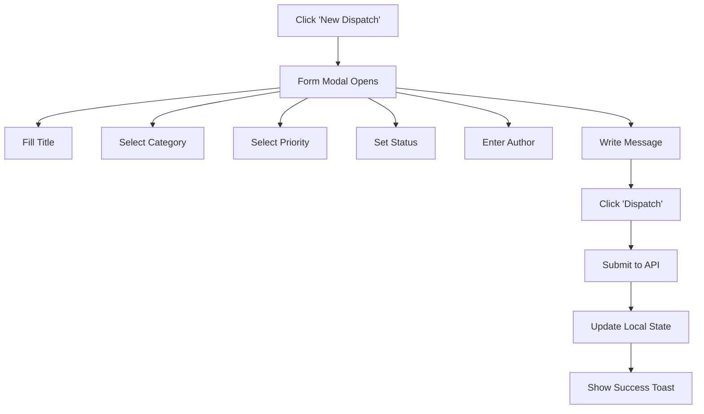
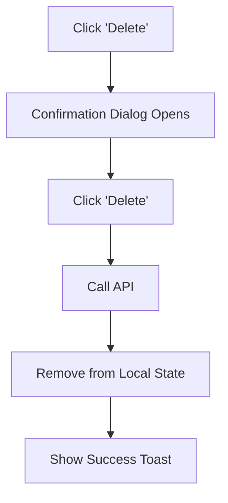

# Announcements Module Documentation

## Overview

The Announcements module provides a comprehensive system for managing official communications and operational updates within the Air Force Reservist system. It supports CRUD operations, priority categorization, and military-themed UI styling.

---

## File Structure

```
client/src/
├── pages/
│   └── Announcements.jsx          # Main page component
├── components/
│   └── announcements/
│       ├── AnnouncementCard.jsx   # Individual announcement display
│       └── AnnouncementForm.jsx   # Create/edit modal form
├── hooks/
│   └── useAnnouncements.js        # Data fetching hook
├── services/
│   └── announcementsService.js    # API service layer
└── components/ui/
    ├── ConfirmationDialog.jsx     # Delete confirmation
    ├── Toast.jsx               # Notification system
    └── Button.jsx                 # Reusable button component
```

---

## Implementation Details

### 1. Data Model

```javascript
{
  id: string,              // Unique identifier
  title: string,           // Announcement subject
  type: 'General' | 'Training' | 'Deployment' | 'Administrative' | 'Emergency',
  priority: 'low' | 'medium' | 'high' | 'critical',
  status: 'active' | 'inactive',
  author: string,          // Originator name
  body: string,            // Message content
  created_at: string       // ISO timestamp
}
```

### 2. Component Hierarchy

```
Announcements (Page)
├── AnnouncementCard (x N)
├── AnnouncementForm (Modal)
└── ConfirmationDialog (Modal)
```

### 3. State Management (useAnnouncements Hook)

| State | Type | Description |
|-------|------|-------------|
| `announcements` | Array | List of all announcements |
| `loading` | boolean | Loading state indicator |
| `error` | string\|null | Error message if fetch fails |

| Function | Description |
|----------|-------------|
| `refetch` | Reload announcements from API |
| `addAnnouncement` | Create new announcement |
| `editAnnouncement(id, data)` | Update existing announcement |
| `removeAnnouncement(id)` | Delete announcement |

---

## User Workflow

### 1. Viewing Announcements

1. Navigate to `/announcements` route
2. Page displays loading spinner while fetching
3. Announcements render in responsive grid (1 col mobile, 2 tablet, 3 desktop)
4. Empty state shows call-to-action when no announcements exist

### 2. Creating an Announcement



### 3. Editing an Announcement

1. Hover over announcement card
2. Click "Edit" button (appears on hover)
3. Modal pre-populated with current values
4. Modify fields as needed
5. Click "Update" to save changes

### 4. Deleting an Announcement



---

## Styling & UI Components

### AnnouncementCard Features

| Feature | Implementation |
|---------|----------------|
| Type Icons | Megaphone, Calendar, Shield, User, AlertCircle |
| Priority Badges | Color-coded: Red (Critical), Orange (High), Yellow (Med), Gray (Low) |
| Status Indicators | Green "OPERATIVE" / Gray "INACTIVE" |
| Hover Actions | Edit/Delete buttons appear on hover |
| Dark Mode | Full support via Tailwind dark: variants |

### Custom Scrollbar

Applied to the announcements grid container:

```jsx
<div className="grid ... overflow-y-auto scrollbar-custom flex-1 min-h-0">
```

CSS utilities defined in `index.css`:
- `scrollbar-width: thin`
- `scrollbar-color: #94a3b8 #f1f5f9` (light mode)
- Dark mode: `scrollbar-color: #475569 #1e293b`

---

## API Endpoints

| Method | Endpoint | Description |
|--------|----------|-------------|
| GET | `/api/announcements` | Fetch all announcements |
| GET | `/api/announcements/:id` | Fetch single announcement |
| POST | `/api/announcements` | Create new announcement |
| PUT | `/api/announcements/:id` | Update announcement |
| DELETE | `/api/announcements/:id` | Delete announcement |

---

## Toast Notifications

| Action | Message | Type |
|--------|---------|------|
| Create | "Announcement created successfully" | success |
| Update | "Announcement updated successfully" | success |
| Delete | "Announcement deleted successfully" | success |
| Error | "Failed to save/delete announcement" | error |

---

## Error Handling

1. **Loading States**: Radio icon with pulse animation
2. **Connection Errors**: Red error card with retry button
3. **Form Validation**: HTML5 required attributes
4. **API Errors**: Toast notification + console.error

---

## Responsive Design Breakpoints

| Breakpoint | Grid Columns | Notes |
|------------|--------------|-------|
| Mobile (< 768px) | 1 | Single column stack |
| Tablet (768px - 1023px) | 2 | Two column grid |
| Desktop (1024px+) | 3 | Three column grid |

---

## Theme Support

Full dark mode support via CSS variables:
- Light: Neutral backgrounds with slate accents
- Dark: Near-black backgrounds with slate ui elements

Toggled via `useTheme()` hook in AppLayout.