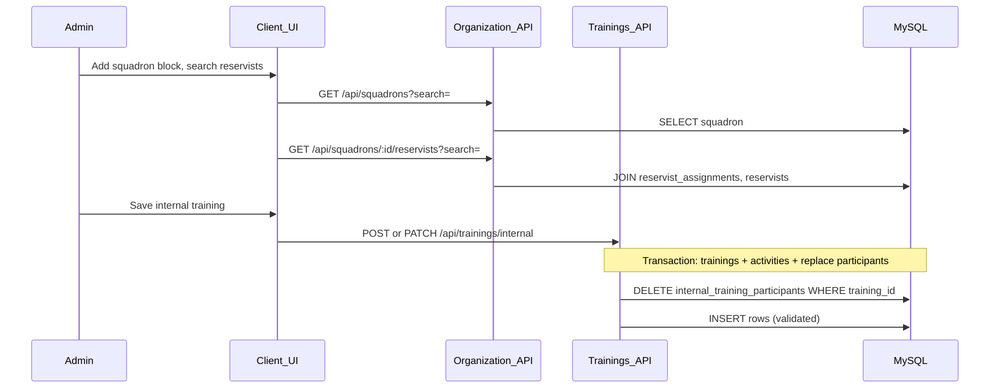

# Internal training: squadrons and targeted reservists

This document describes the **feature flow** for assigning internal (PAFR) trainings to **squadrons** and **specific reservists** who are expected to attend. It aligns with `WORKFLOW.md`, `UI_WORKFLOW.md`, and `BACKEND_WORKFLOW.md` (Routes → Controller → Service → Model → DB).

---

## Goal

- Admins can add **one or more squadron blocks** on the internal training form.
- For each squadron, they **search and select reservists** assigned to that squadron (via `reservist_assignments`).
- Selections are **saved** with the training and **reloaded** when editing.

---

## Data model

**Table: `internal_training_participants`**

| Column         | Purpose |
|----------------|---------|
| `training_id`  | Internal training id (logical ref to `trainings.id`; no DB FK in migration for MyISAM compatibility) |
| `reservist_id` | Reservist id (logical ref to `reservists.id`) |
| `squadron_id`  | Squadron under which the reservist was chosen (logical ref to `squadron.id`) |
| `created_at`   | Audit |

**Primary key:** (`training_id`, `reservist_id`) — each reservist appears at most once per training. If the same person is picked under two blocks, the server **deduplicates** to one row (first occurrence wins).

**Database FKs:** The migration `server/sql/internal_training_participants.up.sql` does **not** add MySQL foreign keys so installs where `trainings` is MyISAM still work. Orphan rows for a deleted training are removed in the trainings **delete** service path.

**Validation:** Before insert, the server verifies `reservist_assignments` contains (`reservist_id`, `squadron_id`) so a reservist cannot be attached to a squadron they do not belong to.

This table is **not** the same as `attendance` (day-of records). It stores **admin targeting / expected participants** only.

---

## Backend flow



### Endpoints

| Method | Path | Auth | Purpose |
|--------|------|------|---------|
| GET | `/api/squadrons` | Admin | Search active squadrons (`search`, `limit`) |
| GET | `/api/squadrons/:id/reservists` | Admin | Search reservists assigned to squadron `id` |
| GET | `/api/trainings/internal/:id` | Optional | Returns training + `participant_groups` |
| POST | `/api/trainings/internal` | Admin | Body may include `participants` |
| PATCH | `/api/trainings/internal/:id` | Admin | Body may include `participants` (full replace) |

### Request body shape (internal create/update)

```json
{
  "title": "...",
  "participants": [
    { "squadron_id": 12, "reservist_ids": [101, 102] },
    { "squadron_id": 15, "reservist_ids": [201] }
  ]
}
```

Omit `participants` or send `[]` to clear all targeted reservists for that training.

### Response shape (GET internal by id)

The training payload includes:

```json
"participant_groups": [
  {
    "squadron_id": 12,
    "squadron_name": "Example Squadron",
    "reservists": [
      {
        "id": 101,
        "first_name": "...",
        "last_name": "...",
        "rank": "...",
        "service_number": "..."
      }
    ]
  }
]
```

---

## Frontend flow

- **Service:** `client/src/services/organizationService.js` — calls organization lookup APIs (no JSX).
- **Component:** `client/src/components/trainings/SquadronParticipantBlocks.jsx` — squadron blocks, search, chips for selected reservists.
- **Form:** `client/src/components/trainings/TrainingForm.jsx` — holds `participantBlocks` in internal form state, maps to `participants` on submit, hydrates from `participant_groups` when editing.

### UX rules

- **Add squadron** appends a new empty block.
- **Remove block** removes that squadron section and its selected reservists.
- Changing the squadron clears previous reservist picks for that block.
- Search is debounced to limit API traffic.

---

## Database migration (existing deployments)

Run on MySQL (after backup):

```text
server/sql/internal_training_participants.up.sql
```

New installs using `server/pafr.sql` already include the table.

---

## Verification checklist

- [ ] Migration applied; API starts without SQL errors.
- [ ] GET `/api/squadrons` returns rows when `squadron` table has data.
- [ ] Create internal training with two blocks; save; GET by id shows `participant_groups`.
- [ ] PATCH with empty `participants` clears rows.
- [ ] Invalid pair (reservist not in squadron) returns 400.

---

**Last updated:** 2026-05-16
